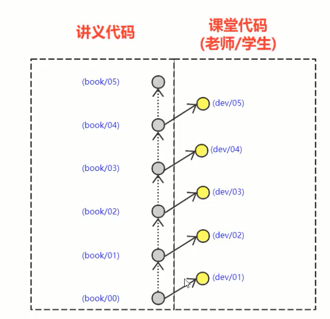
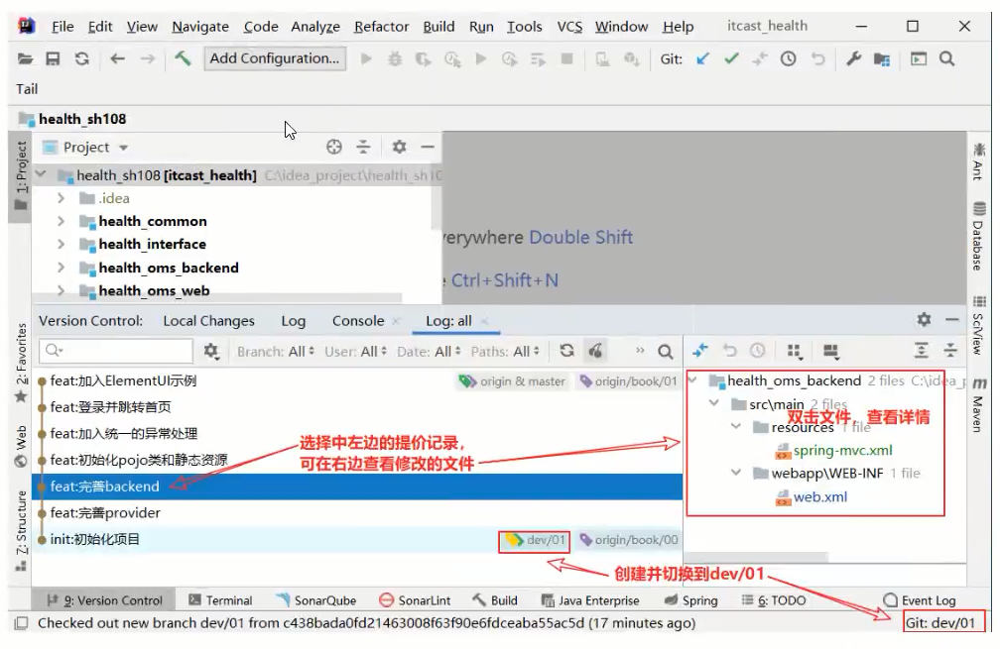

# GIT实战-基于GIT的项目代码下发

---

## 1.为什么使用GIT

​		1.给学生git实战的机会

​				多数企业都选择GIT作为代码管理的工具。学生在前面的课程中学习完GIT之后没有使用场景，缺少使用的机会。这里采用git下发项目代码就是为例给学生使用git的机会。

​		2.项目实战需要

​				项目实战阶段是团队作战，需要使用git进行代码管理，这里使用git下发代码就是为了给同学们热一热身。

​		3.与每次课copy代码相比，使用GIT更有优势

| **name** | **代码获取**                   | **代码使用**                                                 | **存储空间** |
| -------- | ------------------------------ | ------------------------------------------------------------ | ------------ |
| GIT      | 每次课程只需要执行git pull即可 | 1-无需每次导入。  2-可以看到每个功能实现步骤的代码细节。  3-学生代码和老师代码在一个项目里，方便查看对照。 | 节省空间     |
| 拷贝     | 每次都要copy                   | 1-每次使用都需要用idea来导入，使用及不方便。  2-学生拿到的代码是一个项目，包含了当堂课和前面课时的代码总和，不容易分清哪部分代码是当时的代码。  3-老师的代码和学生代码在不同的项目里，所以需要打开多个IDEA进行代码参考。 | 浪费空间     |

## 2.分支模型

核心思想：

		- 课前：

​			老师：每次课前都会给学生共享1个分支（推送到远程仓库）

​				-- book/xx分支

​                --  这是本次课要实现的代码分支，和讲义的代码完全一致。

​               -- 里面的代码提交记录，详细描述了每一次对代码修改的细节。

​            学生：将代码更新到本地（也就是git pull 拉取到本地）

- 课上：（老师和学生操作完全一致，模仿老师即可）

​			-- 执行fetch操作（可是使用IDEA可视化操作，也可以使用命令操作）

​            -- 创建一个本次课的开发分支：

​					- 格式：dev/xx

​                    - 从上一次课的实现代码上创建本次课程的代码，例如： 

​                              -- 第1天，就从book/00创建一个开发分支dev/01

​                                          --- book/00是我们项目的初始代码分支 

​                              -- 第2天，就从book/01创建一个开发分支dev/02

​                                  ......

​                              -- 第10天，就从book/09创建一个开发分支dev/10

## 3.实战（作业）

远程仓库地址: https://gitee.com/czbk_zhang_meng/health_sh108.git

要求：

1.使用IDEA工具将传智健康项目的远程仓库克隆到本地

2.创建并且切换到第1天的开发分支dev/01

3.尝试根据提交记录查看传智健康项目第1天的代码细节。

