# Git分布式版本控制工具
---

# 1、目标
- 了解Git基本概念
- 能够概述Git工作流程
- 能够使用Git常用命令
- 熟悉Git代码托管服务
- 能够使用idea操作git


# 2、概述

## 2.1 开发中的实际场景
```tex
场景一： 备份
 	小明负责的模块就要完成了，就在即将Release之前的一瞬间，电脑突然蓝屏，硬盘光荣牺牲！几个月以来的努力付之东流。


场景二：代码还原
	这个项目中需要一个很复杂的功能，老王摸索了一个星期终于有眉目了，可是这被改得面目全非的代码已经回不到从前了。
什么地方能买到哆啦A梦的时光机啊！

场景三： 协同开发
	小刚和小强先后从文件服务器上下载了同一个文件：Analysis.java。小刚在Analysis.java文件中的第30行声明了一个方法，
叫count()，先保存到了文件服务器上；小强在Analysis.java文件中的第50行声明了一个方法，叫sum(),也随后保存到了服务器上，
于是，count()方法就只存在于小刚的记忆中了。

场景四：追溯问题代码的编写人和编写时间！
    老王是另一位项目经理，每次因为项目进度挨骂之后，他都不知道该扣哪个程序员的工资！就拿这次来说吧，
有个bug调试了30多个小时才知道是因为相关属性没有在应用初始化时赋值！可是二胖、王东、刘流和正经牛都不承认是自己干的！


```

## 2.2 版本控制器的方式
```tex
a、 集中式版本控制工具
   集中式版本控制工具，版本库是集中式存放在中央服务器的。team里每个人work时从中央服务器下载代码，是必须联网才能工作，
局域网或互联网，个人修改后然后提交到中央版本库。

b、 分布式版本控制工具
	分布式版本控制系统没有“中央服务器”，每个人的电脑上都是一个完整的版本库，这样工作的时候，无需要联网了，因为版本库就在你自己的
电脑上，多人协作只需要各自的修改推送给对方，就能互相看到对方的修改了。

举例子： git
  
  
```
## 2.3 SVN
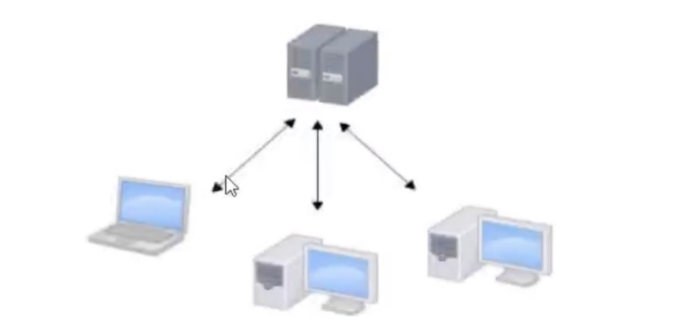


## 2.4 Git

```txt
		Git是分布式的，Git不需要有中心服务器，我们每台电脑拥有的东西都是一样的。我们使用Git并且有个中心服务器，仅仅是为了方便交换大家的修改，但是这个服务器的地位和我们每个人的PC是一样的。我们可以把它当做一个开发者的pc就可以了，就是为了大家代码容易交流不关机用的。没有它大家一样可以工作，只不过“交换”修改不方便而已。
		git是一个开源的分布式版本控制系统，可以有效、高效地处理从很小到非常大的项目版本管理。Git是Linus Torvalds为了帮助管理Linux内核开发而开发的一个开放源代码的版本控制软件。
同生活中的许多伟大的事物一样，Git诞生于一个极富纷争大举创新的年代。Linux 内核开源项目有着为数众多的参与者。绝大多数的Linux内核维护工作都花在了提交补丁和保存归档的繁琐事务上（1991——2002年间）。到2002年，整个项目组开始启用一个专有的分布式版本控制系统BitKeeper来管理和维护代码。
到了2005年，开发BitKeeper的商业公司同Linux内核开源社区的合作关系结束，他们收回了Linux内核社区免费使用BitKeeper的权利。这就迫使Linux开源社区（特别是Linux 的缔造者 Linux Torvalds）基于使用BitKeeper时的经验教训，开发出自己的版本系统。他们对新的系统制订了若干目标：
	速度
	简单的设计
	对非线性开发模式的强力支持（允许成千上万并行开发的分支）
	完全分布式
	有能力高效管理类似Linux内核一样的超大规模项目（速度和数据量）
```

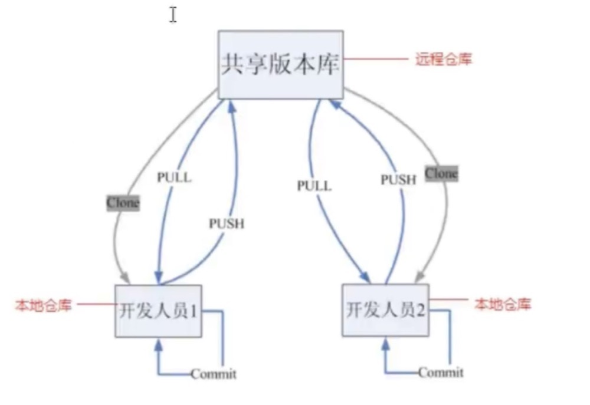


## 2.5 Git工作流程图

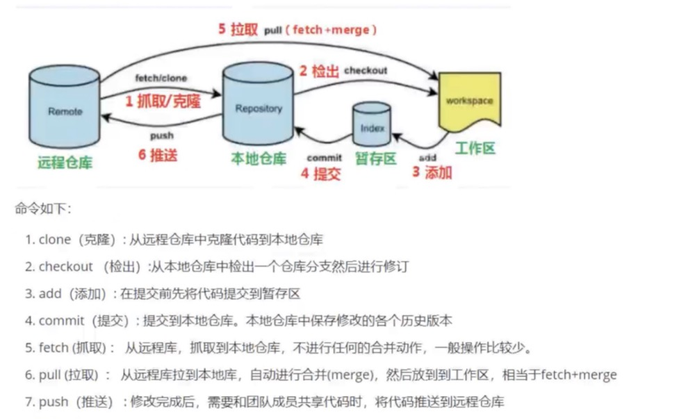

```txt
命令如下：
	1.clone(克隆)：从远处仓库中克隆代码到本地仓库
	2.checkou(检出)：从本地仓库中检出一个仓库分支然后进行修订
	3.add(添加)：在提交前先将代码提交到暂存区
	4.commit(提交)：提交到本地仓库。本地仓库中保存修改的各个历史版本
	5.fetch(抓取)：从远程库，抓取到本地仓库，不进行任何的合并动作，一般操作比较少。
	6.pull(拉取)：从远程库拉到本地库，自动进行合并（merge），然后放到工作区，相当于fetch+merge
	7.push(推送)：修改完成后，需要和团队成员共享代码时，将代码推送到远程仓库
	
```


# 3、Git安装与常用命令

---

​	本教程里的git命令例子都是在Git Bash中演示的，会用到一些基本的linux命令，在此为大家提前列举：

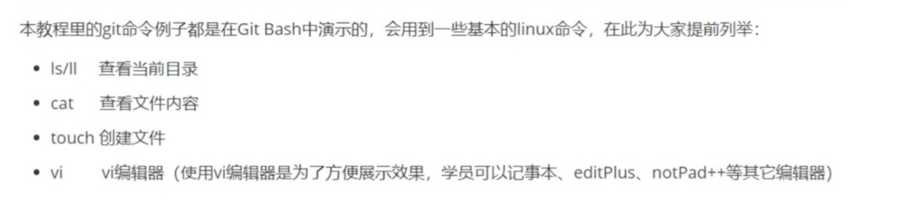

- Ls/ll  查看当前目录
- cat   查看文件内容
- touch 创建文件
- vi vi编辑器（使用vi编辑器是为了方便展示效果，学员可以通过记事本、editPlus、notPad++ 等其它编辑器）


## 3.1 Git环境配置

### 3.1.1 下载与安装

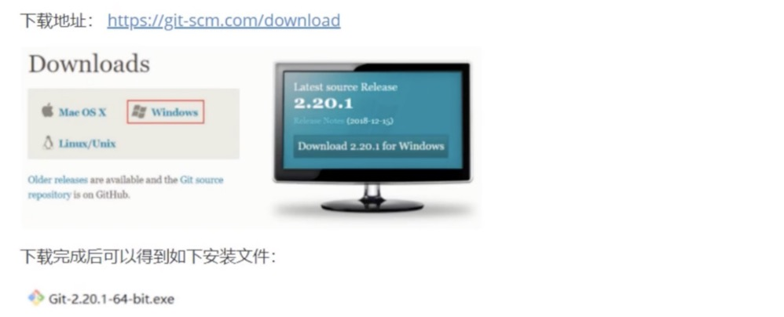

[下载地址：]: https//git-scm.com/download

双击下载的安装文件来安装Git。安装完成后在电脑桌面（也可以是其他目录）点击右键，如果能够看到如下两个菜单则说明Git安装成功。

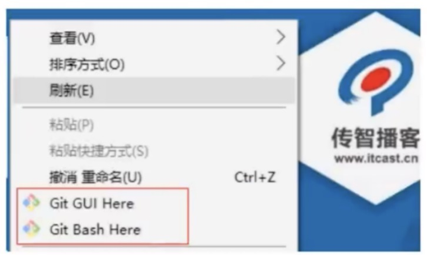

备注：

​	Git GUI：Git提供的图形界面工具

   Git Bash：Git提供的命令行工具

当安装Git后首先要做的事情是设置用户名称和email地址。这是非常重要的，因为每次Git提交都会使用该用户信息。

### 3.1.2 基本配置

1.打开Git Bash

 2.设置用户信息

```shell
git config --global user.name "itcast"
git config --global user.email "hello@itcast.cn"
```

3. 查看配置信息

```shell
git config --global user.name
git config --global user.email
```


### 3.1.3 为常用指令配置别名（可选）

有些常用的指令参数非常多，每次都要输入好多参数，我们可以使用别名。

1.打开用户目录，创建.bashrc 文件

部分windows系统不允许用户创建点号开头的文件，可以打开GitBash，执行 touch ~/.bashrc


> 特别备注： 波浪符 ～ 代表的就是当前用户的根目录的哈！！！

2.在.bashrc文件中输入如下内容：

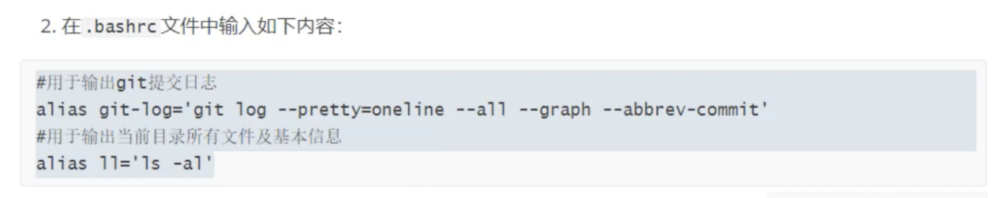

```shell
# 用于输出git提交日志
alias git-log ='git log --pretty=oneline --all --graph --abbrev-commit'

# 用于输出当前目录所有文件及基本信息
alias ll='ls -al'
```

3.打开GitBash，执行source ~/.bashrc 

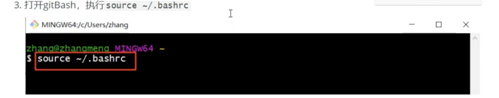


### 3.1.4 解决GitBash乱码问题

1.打开GitBash执行下面命令

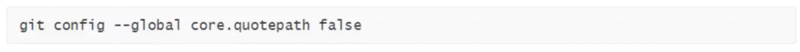

```shell
git config --global core.quotepath false
```


2.${git_home}/etc/bash.bashrc 文件最后加入下面的两行

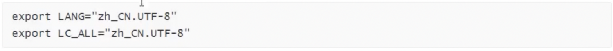

```shell
export LANG="zh_CN.UTF-8"
export LC_ALL="zh_CN.UTF-8"
```


## 3.2 获取本地仓库

要使用Git对我们的代码进行版本控制，首先需要获得本地仓库

1）在电脑的任意位置创建一个空的目录（例如test）作为我们的本地Git仓库

2）进入这个目录中，点击右键打开GitBash窗口

3）执行命令git init

4）如果创建成功后可在文件夹下看到隐藏的.git目录。

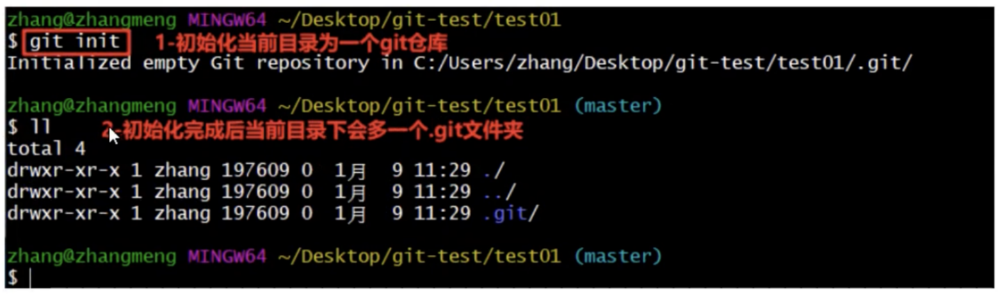

## 3.3 基础操作指令

Git工作目录下对于文件的修改（增加、删除、更新）会存在几个状态，这些修改的状态会随着我们执行Git命令而发生变化。

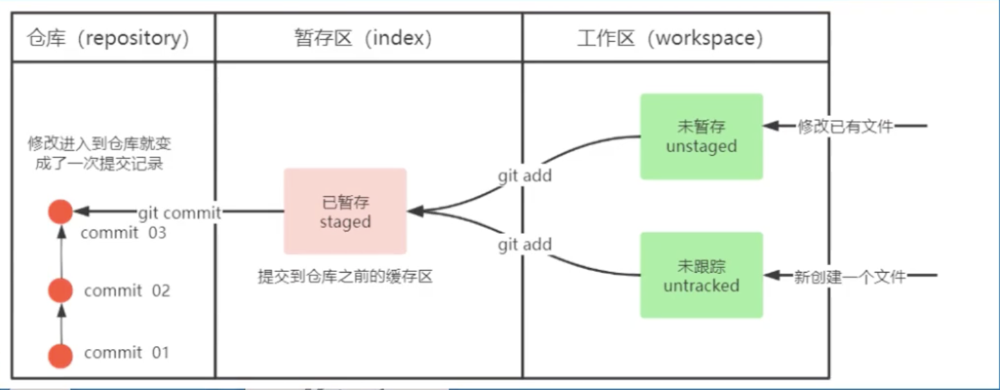

本章节主要讲解如何使用命令来控制这些状态之间的转换：

1.git add (工作区-》暂存区)

```shell
git add
```

2.git commit(暂存区-》本地仓库)

```shell
git commit
```

### 3.3.1 查看修改的状态（status）

- 作用：查看的修改状态（暂存区、工作区）
- 命令形式：git status

```shell
git status
```


### 3.3.2 添加工作区到暂存区（add）

- 作用：添加工作区一个或者多个文件的修改到暂存区

- 命令形式：git add 单个文件名｜通配符

  - [x] ​    将所有修改加入到暂存区：git add .

  ```shell
  git add .
  ```

  

### 3.3.3 提交暂存区到本地仓库（commit）

- 作用：提交暂存区内容到本地仓库的当前分支
- 命令形式：git commit -m '注释内容'

```shell
git commit -m '注释内容'
```


### 3.3.4 *查看提交日志（log）

**在3.1.3中配置的别名git-log 就包含了这些参数，所以后续可以直接使用指令git-log**

- 作用：查看提交记录
- 命令形式：git log [option]

​          Options ：

				- --all 显示所有分支
				- --pretty=oneline 将提交信息显示为一行
				- --abbrev-commit 使得输出的commitId更简短
				- --graph 以图的形式显示


### 3.3.5 版本回退

- 作用：版本切换
- 命令形式：git reset --hard commitID

```shell
git reset --hard commitID
```

 *commitID可以使用git-log或者git log指令查看

- 如何查看已经删除的记录？

- [ ] ​	git reflog

```shell
git reflog
```


- [ ]    这个指令可以看到已经删除的提交记录


### 3.3.6 添加文件至忽略列表

一般我们总会有些文件无需纳入Git的管理，也不希望它们总出现在未跟踪文件列表。通常都是些自动生成的文件，比如日志文件，或者编译过程中创建的临时文件等。在这种情况下，我们可以在工作目录中创建一个名为.gitignore的文件（文件名称固定），列举出忽略的文件模式。下面是一个示例：

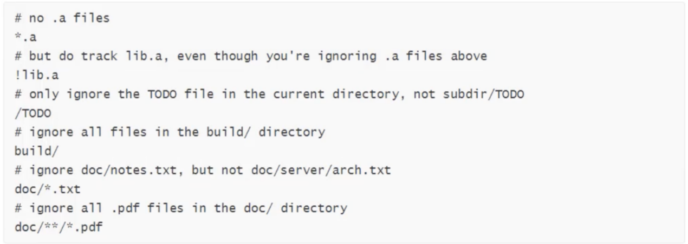

```txt
备注说明：这里的命令git add . 是指的把当前目录的所有文件都加入到暂存区。你也可以使用 git add test001.txt ，表示的是把文件 test001.txt 放入到暂存区！！！


备注：这里的命令： git commit -m “add file01” 表示的是把文件提交到本地仓库，同时写好提交的的message信息。


备注：这里的命令： git log  指令可以看到提交的日志记录信息！！！


```


练习:基础操作

## 3.4 分支

### 3.4.1 查看本地分支

### 3.4.2 创建本地分支

### 3.4.4 切换分支（checkout）

### 3.4.6 合并分支(merge)

### 3.4.7 删除分支

### 3.4.8 解决冲突

### 3.4.9 开发中分支使用原则与流程

练习:分支操作

## 3.5 ？？？

# 4、Git远程仓库

## 4.1 常用的托管服务[远程仓库]

## 4.2 注册码云

## 4.3 创建远程仓库

## 4.4 配置SSH公钥

## 4.5 操作远程仓库

### 4.5.1 添加远程仓库

### 4.5.2 查看远程仓库

### 4.5.3 推送到远程仓库

### 4.5.4 本地分支与远程分支的关联关系

### 4.5.5 从远程仓库克隆

### 4.5.6 从远程仓库中抓取和拉取

### 4.5.7 解决合并冲突

练习:远程仓库操作

# 5 在Idea中使用Git

## 5.1 在Idea中配置Git

## 5.2 在Idea中操作Git

### 5.2.1 创建项目远程仓库（参照4.3）

### 5.2.2 初始化本地仓库

### 5.2.3 设置远程仓库

### 5.2.4 提交到本地仓库

### 5.2.6 推送到远程仓库

### 5.2.7 克隆远程仓库到本地

### 5.2.8 创建分支

### 5.2.9 切换分支及其他分支相关操作

### 5.2.11 解决冲突

## 5.3 IDEA常用GIT操作入口

## 5.4 场景分析

附: 几条铁令
附：疑难问题解决
  1.windows下看不到隐藏的文件（.bashrc \ .gitignore）
  2.windows下无法创建.ignore|.bashrc文件

附：IDEA集成GitBash作为Terminal


